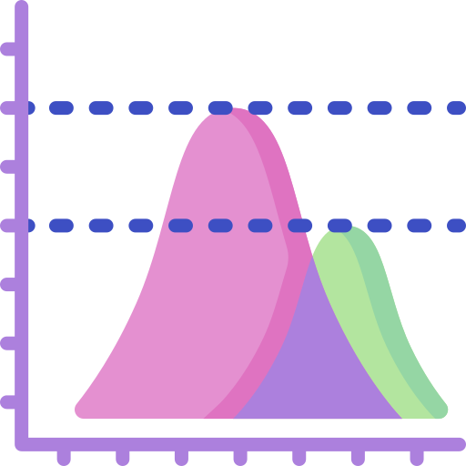
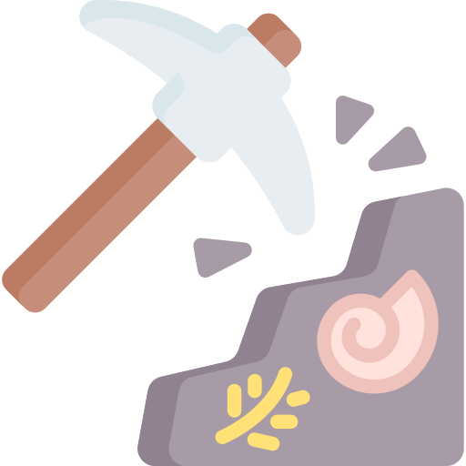
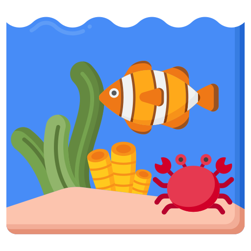

::: pubsintro
<h6>Below is a list of my current publications and their themes. You can also see my Google Scholar, orcID or Web of Science profiles.</h6>
:::

::: tablekey
{#bigdata fig-alt="logo representing management of big data and databases" fig-align="left" width="30"} Management of big data & databases  {#stats fig-alt="logo representing statistical analyses" fig-align="left" width="30"} Statistical analysis  {fig-align="left" width="30"} Computational methods creation  {fig-alt="logo representing arthropod morphology" fig-align="left" width="30"} Morphology & morphometrics  {fig-alt="logo representing palaeontology field work" fig-align="left" width="30"} Palaeontological specimens & field work  {fig-alt="logo representing marine ecologies and environments" fig-align="left" width="30"} Palaeoecology & fluid dynamics  {fig-alt="logo representing accessible science" fig-align="left" width="30"} Open science principles
:::

<h2>Scientific publications</h2>

+----------------------------------------------------------------------------------------------------------------------------------------------------------------------------------------------------------------------------------------------------------------------------------------------------------------------------------------+---------------------------------------------------------------------------------------------------------------------------------------------------------------------------------------------------------------------------------------------------------------------------------------------------------------------+---------------------------------------------------------------------------------------+
|                                                                                                                                                                                                                                                                                                                                        |                                                                                                                                                                                                                                                                                                                     |                                                                                       |
+:======================================================================================================================================================================================================================================================================================================================================:+=====================================================================================================================================================================================================================================================================================================================+=======================================================================================+
| {width="40"} {fig-alt="logo representing statistical analyses" fig-align="left" width="40"} *{fig-alt="logo representing accessible science" fig-align="left" width="50"}*                                                                                                    | Cooper, N. & **BES Data and Code Hackathon Group**. 2026. Data‐and code‐archiving in the British Ecological Society journals: Present status and recommendations for future improvements. *Methods in Ecology and Evolution* 17                                                                                     | [online access](https://doi.org/10.1111/2041-210x.70338)                              |
+----------------------------------------------------------------------------------------------------------------------------------------------------------------------------------------------------------------------------------------------------------------------------------------------------------------------------------------+---------------------------------------------------------------------------------------------------------------------------------------------------------------------------------------------------------------------------------------------------------------------------------------------------------------------+---------------------------------------------------------------------------------------+
| {fig-alt="logo representing palaeontology field work" fig-align="left" width="40"} {fig-alt="logo representing arthropod morphology" fig-align="left" width="40"}                                                                                                                                   | Lynch, S., Gueriau, P., **Drage, H.B.,** Dutheil, D.B., Charbonnier, S., Corthésy, N., Luque, J., Martin Olmos, C. & Daley, A.C. 2026. Moulting and development in a freshwater prawn from the Cretaceous of Morocco. *PeerJ* 14                                                                                    | [online access](https://doi.org/10.7717/peerj.20463)                                  |
+----------------------------------------------------------------------------------------------------------------------------------------------------------------------------------------------------------------------------------------------------------------------------------------------------------------------------------------+---------------------------------------------------------------------------------------------------------------------------------------------------------------------------------------------------------------------------------------------------------------------------------------------------------------------+---------------------------------------------------------------------------------------+
| {fig-alt="logo representing palaeontology field work" fig-align="left" width="40"}                                                                                                                                                                                                                                     | Daley, A.C., Gueriau, P., Lustri, L., **Drage, H.B.,** Lynch, S., Monceret, E. & Monceret, S. 2026. Euarthropods from the Early Ordovician Cabrières Biota, including a new aglaspidid and freshly moulted trilobite material. *Lethaia* 59                                                                         | [online access](https://doi.org/10.18261/let.59.2.12)                                 |
+----------------------------------------------------------------------------------------------------------------------------------------------------------------------------------------------------------------------------------------------------------------------------------------------------------------------------------------+---------------------------------------------------------------------------------------------------------------------------------------------------------------------------------------------------------------------------------------------------------------------------------------------------------------------+---------------------------------------------------------------------------------------+
| {fig-alt="logo representing palaeontology field work" fig-align="left" width="40"}                                                                                                                                                                                                                                     | Saleh, F., **et al.** 2026. Preservation modes of exceptionally preserved fossils from the Early Ordovician Cabrières Biota (France). *Lethaia* 59                                                                                                                                                                  | [online access](https://doi.org/10.18261/let.59.2.6)                                  |
+----------------------------------------------------------------------------------------------------------------------------------------------------------------------------------------------------------------------------------------------------------------------------------------------------------------------------------------+---------------------------------------------------------------------------------------------------------------------------------------------------------------------------------------------------------------------------------------------------------------------------------------------------------------------+---------------------------------------------------------------------------------------+
| *{fig-alt="logo representing accessible science" fig-align="left" width="50"}*                                                                                                                                                                                                                                      | Marty, D., Cavin, L., Daley, A.C., **Drage, H.B.,** Hautmann, M., Joyce, W. & Klug, C. 2026. Editorial – Swiss Journal of Palaeontology migrates to Pensoft Publishers. *Swiss Journal of Palaeontology* 145                                                                                                        | [online access](https://doi.org/10.3897/sjp.145.181236)                               |
+----------------------------------------------------------------------------------------------------------------------------------------------------------------------------------------------------------------------------------------------------------------------------------------------------------------------------------------+---------------------------------------------------------------------------------------------------------------------------------------------------------------------------------------------------------------------------------------------------------------------------------------------------------------------+---------------------------------------------------------------------------------------+
| *{fig-align="left" width="40"}*                                                                                                                                                                                                                                                                                    | Leone, M., Rech de Laval, V., **Drage, H.B.,** Waterhouse, R.M. & Robinson-Rechavi, M. 2026. TaxonMatch: taxonomic integration and tree construction from heterogeneous biological databases. *bioRxiv* preprint                                                                                                    | [online access](https://doi.org/10.64898/2026.03.18.712418)                           |
+----------------------------------------------------------------------------------------------------------------------------------------------------------------------------------------------------------------------------------------------------------------------------------------------------------------------------------------+---------------------------------------------------------------------------------------------------------------------------------------------------------------------------------------------------------------------------------------------------------------------------------------------------------------------+---------------------------------------------------------------------------------------+
| {fig-alt="logo representing arthropod morphology" fig-align="left" width="40"} {fig-alt="logo representing marine ecologies and environments" fig-align="left" width="40"}                                                                                                                           | Kim, K., Lynch, S., **Drage, H.B.,** Antcliffe, J.B., Chipman, A.D., Daley, A.C. & Robinson-Rechavi, M. Morphological characterization of moulting in the Atlantic horseshoe crab Limulus polyphemus and evolutionary insights into ecdysis patterns in Arthropoda. 2026. *bioRxiv* preprint                        | [online access](https://doi.org/10.64898/2026.02.27.708456)                           |
+----------------------------------------------------------------------------------------------------------------------------------------------------------------------------------------------------------------------------------------------------------------------------------------------------------------------------------------+---------------------------------------------------------------------------------------------------------------------------------------------------------------------------------------------------------------------------------------------------------------------------------------------------------------------+---------------------------------------------------------------------------------------+
| {width="40"} {fig-alt="logo representing statistical analyses" fig-align="left" width="40"} {fig-alt="logo representing palaeontology field work" fig-align="left" width="40"} {fig-alt="logo representing arthropod morphology" fig-align="left" width="40"} | **Drage, H.B.** & Pates, S. 2025. Hierarchical importance of factors impacting trilobite cephalic disparity. *bioRxiv* preprint                                                                                                                                                                                     | [online access](https://doi.org/10.1101/2025.07.08.663686)                            |
+----------------------------------------------------------------------------------------------------------------------------------------------------------------------------------------------------------------------------------------------------------------------------------------------------------------------------------------+---------------------------------------------------------------------------------------------------------------------------------------------------------------------------------------------------------------------------------------------------------------------------------------------------------------------+---------------------------------------------------------------------------------------+
| *{fig-align="left" width="40"}{fig-alt="logo representing accessible science" fig-align="left" width="50"}*                                                                                                                                                                                     | Jones L.A., Dean C.D., Allen B.J., **Drage H.B.**, Gearty, W., Flannery-Sutherland J.T., Chiarenza A.A., Dillon E.M., Farina B.M. & Godoy P.L. Ten simple rules to follow when cleaning occurence data in palaeobiology. *Palaeontology* 68                                                                         | [online access](https://doi.org/10.1111/pala.70028)                                   |
+----------------------------------------------------------------------------------------------------------------------------------------------------------------------------------------------------------------------------------------------------------------------------------------------------------------------------------------+---------------------------------------------------------------------------------------------------------------------------------------------------------------------------------------------------------------------------------------------------------------------------------------------------------------------+---------------------------------------------------------------------------------------+
| *{fig-alt="logo representing accessible science" fig-align="left" width="50"}*                                                                                                                                                                                                                                      | **Drage, H.B.**, Keating, J.N., Nielsen, M.L., Saleh, F. & Wong Hearing, T.W. 2024. *Open Palaeontology*: a new model of diamond open access journal for palaeontology. *Open Palaeontology* 1:1                                                                                                                    | [online access](doi.org/10.26034/la.opal.2024.6223)                                   |
+----------------------------------------------------------------------------------------------------------------------------------------------------------------------------------------------------------------------------------------------------------------------------------------------------------------------------------------+---------------------------------------------------------------------------------------------------------------------------------------------------------------------------------------------------------------------------------------------------------------------------------------------------------------------+---------------------------------------------------------------------------------------+
| {width="40"} {fig-alt="logo representing statistical analyses" fig-align="left" width="40"} {fig-alt="logo representing palaeontology field work" fig-align="left" width="40"} {fig-alt="logo representing arthropod morphology" fig-align="left" width="40"} | **Drage, H.B.** & Pates, S. 2024. Distinct causes underlie double-peaked trilobite morphological disparity in cephalic shape. *Communications Biology* 7:1490                                                                                                                                                       | [online access](https://doi.org/10.1038/s42003-024-07221-2)                           |
+----------------------------------------------------------------------------------------------------------------------------------------------------------------------------------------------------------------------------------------------------------------------------------------------------------------------------------------+---------------------------------------------------------------------------------------------------------------------------------------------------------------------------------------------------------------------------------------------------------------------------------------------------------------------+---------------------------------------------------------------------------------------+
| {fig-alt="logo representing marine ecologies and environments" fig-align="left" width="40"} {fig-alt="logo representing statistical analyses" fig-align="left" width="40"}                                                                                                                                | **Drage, H.B.**, Pates, S. & Minter, N.J. 2024. Experimental protocol for validation of computational fluid dynamics palaeontological simulations. *EcoEvoRxiv* preprint                                                                                                                                            | [online access](https://doi.org/10.32942/X28W36)                                      |
+----------------------------------------------------------------------------------------------------------------------------------------------------------------------------------------------------------------------------------------------------------------------------------------------------------------------------------------+---------------------------------------------------------------------------------------------------------------------------------------------------------------------------------------------------------------------------------------------------------------------------------------------------------------------+---------------------------------------------------------------------------------------+
| {fig-alt="logo representing marine ecologies and environments" fig-align="left" width="40"} {fig-alt="logo representing statistical analyses" fig-align="left" width="40"}                                                                                                                                | Pates, S. & **Drage, H.B.** 2024. Hydrodynamic function of genal prolongations in trinucleimorph trilobites revealed by computational fluid dynamics. *BioRxiv* preprint                                                                                                                                            | [online access](https://doi.org/10.1101/2024.01.26.577348)                            |
+----------------------------------------------------------------------------------------------------------------------------------------------------------------------------------------------------------------------------------------------------------------------------------------------------------------------------------------+---------------------------------------------------------------------------------------------------------------------------------------------------------------------------------------------------------------------------------------------------------------------------------------------------------------------+---------------------------------------------------------------------------------------+
| {fig-alt="logo representing management of big data and databases" fig-align="left" width="40"}                                                                                                                                                                                                                 | Campli, G., Volovych, O., Kim, K., Veldsman, W.P., **Drage, H.B.**, Sheizaf, I., Lynch, S., Chipman, A.D., Daley, A.C., Robinson-Rechavi, M. & Waterhouse, R.M. 2024. The moulting arthropod: a complete genetic toolkit review. *Biological Reviews* 99:6                                                          | [online access](https://doi.org/10.1111/brv.13123)                                    |
+----------------------------------------------------------------------------------------------------------------------------------------------------------------------------------------------------------------------------------------------------------------------------------------------------------------------------------------+---------------------------------------------------------------------------------------------------------------------------------------------------------------------------------------------------------------------------------------------------------------------------------------------------------------------+---------------------------------------------------------------------------------------+
| {fig-alt="logo representing palaeontology field work" fig-align="left" width="40"}                                                                                                                                                                                                                                     | Saleh, F., **et al.** 2024. Reply to: The Cabrières Biota is not a Konservat-Lagerstätte. *Nature Ecology & Evolution* 8                                                                                                                                                                                            | [online](https://doi.org/10.1038/s41559-024-02560-z)\                                 |
|                                                                                                                                                                                                                                                                                                                                        |                                                                                                                                                                                                                                                                                                                     | PDF                                                                                   |
+----------------------------------------------------------------------------------------------------------------------------------------------------------------------------------------------------------------------------------------------------------------------------------------------------------------------------------------+---------------------------------------------------------------------------------------------------------------------------------------------------------------------------------------------------------------------------------------------------------------------------------------------------------------------+---------------------------------------------------------------------------------------+
| {fig-alt="logo representing statistical analyses" fig-align="left" width="40"} {fig-alt="logo representing palaeontology field work" fig-align="left" width="40"} {fig-alt="logo representing arthropod morphology" fig-align="left" width="40"}                                      | Lynch, S., Żylińska, A., Daley, A.C. & **Drage, H.B.** 2024. Dual role of enrolment for moulting and protection in a Cambrian trilobite from Poland. *Lethaia* 57:1                                                                                                                                                 | [online access](https://doi.org/10.18261/let.57.1.4)                                  |
+----------------------------------------------------------------------------------------------------------------------------------------------------------------------------------------------------------------------------------------------------------------------------------------------------------------------------------------+---------------------------------------------------------------------------------------------------------------------------------------------------------------------------------------------------------------------------------------------------------------------------------------------------------------------+---------------------------------------------------------------------------------------+
| {fig-alt="logo representing palaeontology field work" fig-align="left" width="40"}                                                                                                                                                                                                                                     | Saleh, F., **et al.** 2024. The Cabrières Biota (France) provides insights into Ordovician polar ecosystems. *Nature Ecology & Evolution* 8                                                                                                                                                                         | [online access](https://doi.org/10.1038/s41559-024-02331-w)                           |
+----------------------------------------------------------------------------------------------------------------------------------------------------------------------------------------------------------------------------------------------------------------------------------------------------------------------------------------+---------------------------------------------------------------------------------------------------------------------------------------------------------------------------------------------------------------------------------------------------------------------------------------------------------------------+---------------------------------------------------------------------------------------+
| {width="40"} {fig-alt="logo representing statistical analyses" fig-align="left" width="40"} {fig-alt="logo representing palaeontology field work" fig-align="left" width="40"} {fig-alt="logo representing arthropod morphology" fig-align="left" width="40"} | **Drage,** **H.B.** 2024. Trilobite moulting behaviour variability had little association with morphometry. *Palaeontologia Electronica* 27(1):a9                                                                                                                                                                   | [online access](https://doi.org/10.26879/1265)\                                       |
|                                                                                                                                                                                                                                                                                                                                        |                                                                                                                                                                                                                                                                                                                     | [PDF](https://palaeo-electronica.org/content/pdfs/1265.pdf)                           |
+----------------------------------------------------------------------------------------------------------------------------------------------------------------------------------------------------------------------------------------------------------------------------------------------------------------------------------------+---------------------------------------------------------------------------------------------------------------------------------------------------------------------------------------------------------------------------------------------------------------------------------------------------------------------+---------------------------------------------------------------------------------------+
| {fig-alt="logo representing accessible science" fig-align="left" width="50"}                                                                                                                                                                                                                                        | **Drage,** **H.B.** & Wong Hearing, T.W. \[joint first-authors\] 2023. Diamond Open Access with Preregistration: a new publishing model for palaeontology. *EarthArXiv* preprint                                                                                                                                    | [online access](https://doi.org/10.31223/X5KH30)                                      |
+----------------------------------------------------------------------------------------------------------------------------------------------------------------------------------------------------------------------------------------------------------------------------------------------------------------------------------------+---------------------------------------------------------------------------------------------------------------------------------------------------------------------------------------------------------------------------------------------------------------------------------------------------------------------+---------------------------------------------------------------------------------------+
| {fig-alt="logo representing palaeontology field work" fig-align="left" width="40"} {fig-alt="logo representing arthropod morphology" fig-align="left" width="40"}                                                                                                                                   | Laibl, L., Gueriau, P., Saleh, F., Pérez-Peris, F., Lustri, L., **Drage, H.B.**, Bath Enright, O.G., Potin, G. & Daley, A.C. 2023. Immature stages of a Lower Ordovician marrellid from Morocco suggest size-induced ontogenetic niche differentiation in early euarthropods. *Frontiers in Ecology & Evolution* 11 | [online access](https://doi.org/10.3389/fevo.2023.1232612)                            |
+----------------------------------------------------------------------------------------------------------------------------------------------------------------------------------------------------------------------------------------------------------------------------------------------------------------------------------------+---------------------------------------------------------------------------------------------------------------------------------------------------------------------------------------------------------------------------------------------------------------------------------------------------------------------+---------------------------------------------------------------------------------------+
| {fig-alt="logo representing palaeontology field work" fig-align="left" width="40"} {fig-alt="logo representing arthropod morphology" fig-align="left" width="40"}                                                                                                                                   | Chipman, A. & **Drage, H.B.** \[joint first-authors\] 2023. Trilobites in rock enrol: Commentary on Esteve and Hughes (2023). *Proceedings of the Royal Society B* 290                                                                                                                                              | [online access](https://doi.org/10.1098/rspb.2023.1547)                               |
+----------------------------------------------------------------------------------------------------------------------------------------------------------------------------------------------------------------------------------------------------------------------------------------------------------------------------------------+---------------------------------------------------------------------------------------------------------------------------------------------------------------------------------------------------------------------------------------------------------------------------------------------------------------------+---------------------------------------------------------------------------------------+
| {fig-alt="logo representing palaeontology field work" fig-align="left" width="40"} {fig-alt="logo representing arthropod morphology" fig-align="left" width="40"}                                                                                                                                   | Laibl, L., **Drage, H.B.**, Pérez-Peris, F., Schöder, S., Saleh, F. & Daley, A.C. 2023. Babies from the Fezouata: adaptations to high latitudes in the early developmental trilobite stages. *Geobios* 81                                                                                                           | [online access](https://doi.org/10.1016/j.geobios.2023.06.005)                        |
+----------------------------------------------------------------------------------------------------------------------------------------------------------------------------------------------------------------------------------------------------------------------------------------------------------------------------------------+---------------------------------------------------------------------------------------------------------------------------------------------------------------------------------------------------------------------------------------------------------------------------------------------------------------------+---------------------------------------------------------------------------------------+
| {fig-alt="logo representing palaeontology field work" fig-align="left" width="40"} {fig-alt="logo representing arthropod morphology" fig-align="left" width="40"}                                                                                                                                   | **Drage, H.B.**, Legg, D.A. & Daley, A.C. 2023. Novel marrellomorph moulting behaviour preserved in the Lower Ordovician Fezouata Shale, Morocco. *Frontiers in Ecology & Evolution* 11                                                                                                                             | [online access](https://doi.org/10.3389/fevo.2023.1226924)                            |
+----------------------------------------------------------------------------------------------------------------------------------------------------------------------------------------------------------------------------------------------------------------------------------------------------------------------------------------+---------------------------------------------------------------------------------------------------------------------------------------------------------------------------------------------------------------------------------------------------------------------------------------------------------------------+---------------------------------------------------------------------------------------+
| {width="40"} {fig-alt="logo representing statistical analyses" fig-align="left" width="40"} {fig-alt="logo representing palaeontology field work" fig-align="left" width="40"} {fig-alt="logo representing arthropod morphology" fig-align="left" width="40"} | **Drage, H.B.**, Holmes, J.D., García-Bellido, D.C. & Paterson, J.R. 2023. Associations between trilobite intraspecific moulting variability and body proportions: *Estaingia bilobata* from the Cambrian Emu Bay Shale, Australia. *Palaeontology* 66                                                              | [online access](https://doi.org/10.1111/pala.12651)                                   |
+----------------------------------------------------------------------------------------------------------------------------------------------------------------------------------------------------------------------------------------------------------------------------------------------------------------------------------------+---------------------------------------------------------------------------------------------------------------------------------------------------------------------------------------------------------------------------------------------------------------------------------------------------------------------+---------------------------------------------------------------------------------------+
| {fig-align="left" width="40"}                                                                                                                                                                                                                                                                                      | Feldsman, W.P., Campli, G., Dind, S., Rach de la Vale, V., **Drage, H.B.**, Chipman, A.D., Waterhouse, R.M., & Robinson-Rechavi, M. 2022. Taxonbridge: an algorithm for the creation and analysis of custom taxonomies. *BioRxiv* preprint                                                                          | [online access](https://doi.org/10.1101/2022.05.02.490269)                            |
+----------------------------------------------------------------------------------------------------------------------------------------------------------------------------------------------------------------------------------------------------------------------------------------------------------------------------------------+---------------------------------------------------------------------------------------------------------------------------------------------------------------------------------------------------------------------------------------------------------------------------------------------------------------------+---------------------------------------------------------------------------------------+
| {fig-alt="logo representing palaeontology field work" fig-align="left" width="40"} {fig-alt="logo representing arthropod morphology" fig-align="left" width="40"} {fig-alt="logo representing marine ecologies and environments" fig-align="left" width="40"}                        | **Drage, H.B.**, Vandenbroucke, T., Van Roy, P. & Daley, A.C. 2019. Sequence of post-moult exoskeleton hardening preserved in a trilobite mass moult assemblage from the Lower Ordovician Fezouata Konservat-Lagerstätte, Morocco. *Acta Palaeontologica Polonica* 64:2                                             | [PDF](https://bibliotekanauki.pl/articles/20934.pdf)                                  |
+----------------------------------------------------------------------------------------------------------------------------------------------------------------------------------------------------------------------------------------------------------------------------------------------------------------------------------------+---------------------------------------------------------------------------------------------------------------------------------------------------------------------------------------------------------------------------------------------------------------------------------------------------------------------+---------------------------------------------------------------------------------------+
| {width="40"} {fig-alt="logo representing statistical analyses" fig-align="left" width="40"} {fig-alt="logo representing palaeontology field work" fig-align="left" width="40"} {fig-alt="logo representing arthropod morphology" fig-align="left" width="40"} | **Drage, H.B.** 2019. Quantifying intra- and interspecific variability in trilobite moulting behaviour across the Palaeozoic. *Palaeontologia Electronica* 22:2                                                                                                                                                     | [PDF](https://pdfs.semanticscholar.org/b099/1ebf29bb140750285ff1408ceb4354af1156.pdf) |
+----------------------------------------------------------------------------------------------------------------------------------------------------------------------------------------------------------------------------------------------------------------------------------------------------------------------------------------+---------------------------------------------------------------------------------------------------------------------------------------------------------------------------------------------------------------------------------------------------------------------------------------------------------------------+---------------------------------------------------------------------------------------+
| {fig-alt="logo representing palaeontology field work" fig-align="left" width="40"} {fig-alt="logo representing arthropod morphology" fig-align="left" width="40"}                                                                                                                                   | Yang, J., Ortega-Hernández, J., **Drage, H.B.**, Du, K. & Zhang, X. 2019. Ecdysis in a stem-group euarthropod from the early Cambrian of China. *Scientific Reports* 9:1                                                                                                                                            | [online access](https://doi.org/10.1038/s41598-019-41911-w)                           |
+----------------------------------------------------------------------------------------------------------------------------------------------------------------------------------------------------------------------------------------------------------------------------------------------------------------------------------------+---------------------------------------------------------------------------------------------------------------------------------------------------------------------------------------------------------------------------------------------------------------------------------------------------------------------+---------------------------------------------------------------------------------------+
| {fig-alt="logo representing palaeontology field work" fig-align="left" width="40"} {fig-alt="logo representing arthropod morphology" fig-align="left" width="40"}                                                                                                                                   | Daley, A.C., Antcliffe, J.B., **Drage, H.B.** & Pates, S. 2018. Early fossil record of Euarthropoda and the Cambrian Explosion. *PNAS* 115:21                                                                                                                                                                       | [online access](https://doi.org/10.1073/pnas.1719962115)                              |
+----------------------------------------------------------------------------------------------------------------------------------------------------------------------------------------------------------------------------------------------------------------------------------------------------------------------------------------+---------------------------------------------------------------------------------------------------------------------------------------------------------------------------------------------------------------------------------------------------------------------------------------------------------------------+---------------------------------------------------------------------------------------+
| {fig-alt="logo representing palaeontology field work" fig-align="left" width="40"}                                                                                                                                                                                                                                     | **Drage, H.B.**, Laibl, L. & Budil, P. 2019. Post-embryonic development of *Dalmanitina*, and the evolution of facial suture fusion in Phacopina. *Paleobiology* 44:4.                                                                                                                                              | [online](https://doi.org/10.1017/pab.2018.31)\                                        |
|                                                                                                                                                                                                                                                                                                                                        |                                                                                                                                                                                                                                                                                                                     | PDF                                                                                   |
+----------------------------------------------------------------------------------------------------------------------------------------------------------------------------------------------------------------------------------------------------------------------------------------------------------------------------------------+---------------------------------------------------------------------------------------------------------------------------------------------------------------------------------------------------------------------------------------------------------------------------------------------------------------------+---------------------------------------------------------------------------------------+
| {fig-alt="logo representing palaeontology field work" fig-align="left" width="40"} {fig-alt="logo representing arthropod morphology" fig-align="left" width="40"}                                                                                                                                   | **Drage, H.B.**, Holmes, J.D., Garcia-Bellido, D.C. & Daley, A.C. 2018. Exceptionally variable trilobite moulting behaviour preserved in the Emu Bay Shale, South Australia. *Lethaia* 51:4                                                                                                                         | [online access](https://doi.org/10.1111/let.12266)                                    |
+----------------------------------------------------------------------------------------------------------------------------------------------------------------------------------------------------------------------------------------------------------------------------------------------------------------------------------------+---------------------------------------------------------------------------------------------------------------------------------------------------------------------------------------------------------------------------------------------------------------------------------------------------------------------+---------------------------------------------------------------------------------------+
| {fig-alt="logo representing palaeontology field work" fig-align="left" width="40"} {fig-alt="logo representing arthropod morphology" fig-align="left" width="40"}                                                                                                                                   | **Drage, H.B.** & Daley, A.C. 2016. Recognising moulting behaviour in trilobites by examining morphology, development, and preservation: Comment on Błażejowski et al. 2015. *BioEssays* 38:10                                                                                                                      | [online access](https://doi.org/10.1002/bies.201600027)                               |
+----------------------------------------------------------------------------------------------------------------------------------------------------------------------------------------------------------------------------------------------------------------------------------------------------------------------------------------+---------------------------------------------------------------------------------------------------------------------------------------------------------------------------------------------------------------------------------------------------------------------------------------------------------------------+---------------------------------------------------------------------------------------+
| {fig-alt="logo representing statistical analyses" fig-align="left" width="40"} {fig-alt="logo representing arthropod morphology" fig-align="left" width="40"} {fig-alt="logo representing marine ecologies and environments" fig-align="left" width="40"}                              | Daley, A.C. & **Drage, H.B.** \[joint first-authors\] 2016. The fossil record of ecdysis, and trends in the moulting behaviour of trilobites. *Arthropod Structure & Development* 45:2                                                                                                                              | [online](https://doi.org/10.1016/j.asd.2015.09.004)\                                  |
|                                                                                                                                                                                                                                                                                                                                        |                                                                                                                                                                                                                                                                                                                     | PDF                                                                                   |
+----------------------------------------------------------------------------------------------------------------------------------------------------------------------------------------------------------------------------------------------------------------------------------------------------------------------------------------+---------------------------------------------------------------------------------------------------------------------------------------------------------------------------------------------------------------------------------------------------------------------------------------------------------------------+---------------------------------------------------------------------------------------+

<h2>Data publications, datasets, outreach publications</h2>

+-------------------------------------------------------------------------------------------------------------------------------------------------------------------------------------------------------------------------------------------+---------------------------------------------------------------------------------------------------------------------------------------------------------------------------------------------------------------------------------------------------------------+-------------------------------------------------------------------------------------------------------------------------+
|                                                                                                                                                                                                                                           |                                                                                                                                                                                                                                                               |                                                                                                                         |
+:=========================================================================================================================================================================================================================================:+===============================================================================================================================================================================================================================================================+=========================================================================================================================+
| {fig-align="left" width="40"} {fig-alt="logo representing accessible science" fig-align="left" width="50"}                                                                                         | Jones L.A., Dean C.D., Allen B.J., **Drage H.B.**, Gearty, W., Flannery-Sutherland J.T., Chiarenza A.A., Dillon E.M., Farina B.M. & Godoy P.L. Ten simple rules to follow when cleaning occurence data in palaeobiology: vignette.                            | [online access](https://tenrules.palaeoverse.org)                                                                       |
+-------------------------------------------------------------------------------------------------------------------------------------------------------------------------------------------------------------------------------------------+---------------------------------------------------------------------------------------------------------------------------------------------------------------------------------------------------------------------------------------------------------------+-------------------------------------------------------------------------------------------------------------------------+
| {width="40"} {fig-align="left" width="40"}                                                                                                                                                    | Rech de Laval, V., Leone, M., **Drage, H.B.**, Lynch, S., Campli, G., Dind, S., Kim, K., Volovych, O., Sheizaf, I., Chipman, A. Daley, A.C., Waterhouse, R. & Robinson-Rechavi, M. MoultDB: arthropod moulting database and website UI. https://moulting.org. | [moultdb database](https://moultdb.org)\                                                                                |
|                                                                                                                                                                                                                                           |                                                                                                                                                                                                                                                               | [moulting website](https://www.moulting.org)                                                                            |
+-------------------------------------------------------------------------------------------------------------------------------------------------------------------------------------------------------------------------------------------+---------------------------------------------------------------------------------------------------------------------------------------------------------------------------------------------------------------------------------------------------------------+-------------------------------------------------------------------------------------------------------------------------+
| {width="40"} {fig-align="left" width="40"} {fig-alt="logo representing statistical analyses" fig-align="left" width="40"}                                                       | Gearty, W., Jones, L.A., Dillon, E., Godoy, P., **Drage, H.B.**, Dean, C. & Farina, B. 2024. CRAN Task View: Paleontology. R package summary for palaeontological analyses. https://cran.r-project.org/view=Paleontology                                      | [CRAN task view](https://cran.r-project.org/view=Paleontology)                                                          |
+-------------------------------------------------------------------------------------------------------------------------------------------------------------------------------------------------------------------------------------------+---------------------------------------------------------------------------------------------------------------------------------------------------------------------------------------------------------------------------------------------------------------+-------------------------------------------------------------------------------------------------------------------------+
| {fig-alt="logo representing arthropod morphology" fig-align="left" width="40"}                                                                                                                                         | **Drage, H.B.** 2024. Euarthropod diversity in Pokémon: searching for the ancestral type. *Journal of Geek Studies* 8:1.                                                                                                                                      | [online access](https://jgeekstudies.org/2024/08/24/euarthropod-diversity-in-pokemon-searching-for-the-ancestral-type/) |
+-------------------------------------------------------------------------------------------------------------------------------------------------------------------------------------------------------------------------------------------+---------------------------------------------------------------------------------------------------------------------------------------------------------------------------------------------------------------------------------------------------------------+-------------------------------------------------------------------------------------------------------------------------+
| {fig-alt="logo representing marine ecologies and environments" fig-align="left" width="40"}                                                                                                                                | Pates, S. & **Drage, H.B.** 2024. Trilobite genal spine 3D models and Ansys (computational fluid dynamics analyses) files.                                                                                                                                    | [online access](www.doi.org/10.17605/OSF.IO/2MAFU)                                                                      |
+-------------------------------------------------------------------------------------------------------------------------------------------------------------------------------------------------------------------------------------------+---------------------------------------------------------------------------------------------------------------------------------------------------------------------------------------------------------------------------------------------------------------+-------------------------------------------------------------------------------------------------------------------------+
| {width="40"} {fig-alt="logo representing palaeontology field work" fig-align="left" width="40"} {fig-alt="logo representing arthropod morphology" fig-align="left" width="40"} | **Drage, H.B.** & Pates, S. 2024. Trilobite cephalon morphometric data, 2D models to produce morphometric data, and R code.                                                                                                                                   | [online access](www.doi.org/10.17605/OSF.IO/VZ9A5)                                                                      |
+-------------------------------------------------------------------------------------------------------------------------------------------------------------------------------------------------------------------------------------------+---------------------------------------------------------------------------------------------------------------------------------------------------------------------------------------------------------------------------------------------------------------+-------------------------------------------------------------------------------------------------------------------------+
| {fig-alt="logo representing palaeontology field work" fig-align="left" width="40"}                                                                                                                                        | Lynch, S., Żylińska, A., Daley, A.C. & **Drage, H.B.** 2024. Strenuella polonica moulting and enrolment data.                                                                                                                                                 | [online access](www.doi.org/10.17605/OSF.IO/MF6SP)                                                                      |
+-------------------------------------------------------------------------------------------------------------------------------------------------------------------------------------------------------------------------------------------+---------------------------------------------------------------------------------------------------------------------------------------------------------------------------------------------------------------------------------------------------------------+-------------------------------------------------------------------------------------------------------------------------+
| {fig-alt="logo representing accessible science" fig-align="left" width="50"}                                                                                                                                           | **Drage, H.B.** & Wong Hearing, T.W. \[joint first-authors\] 2023. A new model for publishing. *The Palaeontological Association Newsletter* 114.                                                                                                             | [online access](https://www.palass.org/publications/newsletter/archive/114/newsletter-no-114)                           |
+-------------------------------------------------------------------------------------------------------------------------------------------------------------------------------------------------------------------------------------------+---------------------------------------------------------------------------------------------------------------------------------------------------------------------------------------------------------------------------------------------------------------+-------------------------------------------------------------------------------------------------------------------------+
| {fig-alt="logo representing palaeontology field work" fig-align="left" width="40"} {fig-alt="logo representing arthropod morphology" fig-align="left" width="40"}                                      | **Drage, H.B.**, Holmes, J.D., García-Bellido, D.C. & Paterson, J.R. 2023. *Estaingia bilobata* morphometry and moulting behaviour data and R code.                                                                                                           | [online access](www.doi.org/10.17605/OSF.IO/7PUHZ)                                                                      |
+-------------------------------------------------------------------------------------------------------------------------------------------------------------------------------------------------------------------------------------------+---------------------------------------------------------------------------------------------------------------------------------------------------------------------------------------------------------------------------------------------------------------+-------------------------------------------------------------------------------------------------------------------------+
| {width="40"} {fig-alt="logo representing palaeontology field work" fig-align="left" width="40"} {fig-alt="logo representing arthropod morphology" fig-align="left" width="40"} | **Drage, H.B.** 2023. Trilobite morphometry and moulting behaviour data and R code.                                                                                                                                                                           | [online access](www.doi.org/10.17605/OSF.IO/7PUHZ)                                                                      |
+-------------------------------------------------------------------------------------------------------------------------------------------------------------------------------------------------------------------------------------------+---------------------------------------------------------------------------------------------------------------------------------------------------------------------------------------------------------------------------------------------------------------+-------------------------------------------------------------------------------------------------------------------------+
| {fig-align="left" width="40"}                                                                                                                                                                                         | Feldsman, W.P., Campli, G., Dind, S., Rach de la Vale, V., **Drage, H.B.**, Chipman, A.D., Waterhouse, R.M., & Robinson-Rechavi, M. 2022. Taxonbridge: an algorithm for the creation and analysis of custom taxonomies.                                       | [R package](https://CRAN.R-project.org/package=taxonbridge)                                                             |
+-------------------------------------------------------------------------------------------------------------------------------------------------------------------------------------------------------------------------------------------+---------------------------------------------------------------------------------------------------------------------------------------------------------------------------------------------------------------------------------------------------------------+-------------------------------------------------------------------------------------------------------------------------+
| {width="40"} {fig-alt="logo representing palaeontology field work" fig-align="left" width="40"} {fig-alt="logo representing arthropod morphology" fig-align="left" width="40"} | **Drage, H.B.** 2019. Trilobite moulting behaviour variability data and R code.                                                                                                                                                                               | [online access](www.doi.org/10.17605/OSF.IO/7PUHZ)                                                                      |
+-------------------------------------------------------------------------------------------------------------------------------------------------------------------------------------------------------------------------------------------+---------------------------------------------------------------------------------------------------------------------------------------------------------------------------------------------------------------------------------------------------------------+-------------------------------------------------------------------------------------------------------------------------+

I have also published 10 newsletter issues for The Palaeontological Association as the Council Newsletter Editor, which are available on the Association [website](https://palass.org/publications/newsletter).

I host my datasets and code freely open access on the [Open Science Framework](https://osf.io/bdx8m/) or Zenodo. You can use these, or get in touch if you want to discuss anything.

From 2019 to 2021 I had a career in science education publishing at Oxford University Press. In these roles I worked on many educational publications, including the following titles. **Get in touch if you’re interested in what it’s like to move from academia to publishing, or in discussing science education.**

- Oxford Smart Activate KS3

- Oxford University Press Oxford Revise: A Level Physics, Chemistry, and Biology

- Oxford University Press Oxford Revise: GCSE Physics, Chemistry, and Biology

- Oxford University Press Maths Skills for AS and A Level Psychology

- Oxford University Press Maths Skills for GCSE Computer Science.
